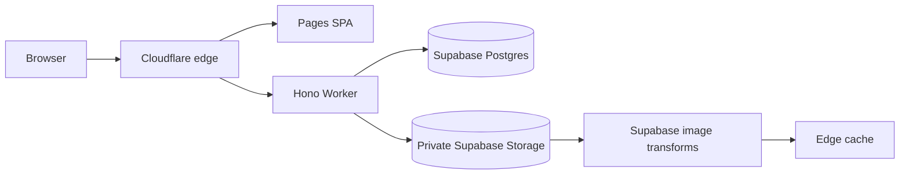
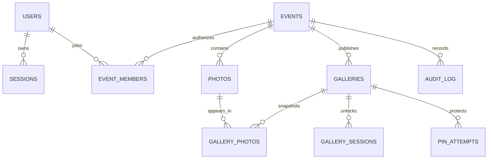

# Arc & Grain

## What this is

Arc & Grain is a private photo-delivery platform for event photography teams.
Photographers upload directly to object storage, a lead reviews and selects the
story, and a client receives a gallery link plus a six-digit PIN—no customer
account or signup flow.

The repository is a strict pnpm monorepo: a Hono Worker backed by Supabase
Postgres and private Supabase Storage, a route-split React 19 application, shared Zod contracts and concurrency
primitives, and a generated Hey API client. The operational interface is dense
and fast; the client interface is intentionally quiet and photograph-led.

## Live demo

A Cloudflare account has not been connected in this checkout, so there is no
public deployment URL yet. The complete local demo is available at
`http://localhost:5173` after setup.

| Audience | Credential |
|---|---|
| Lead | `admin@demo.trizen.dev` / `TrizenDemo!2026` |
| Member | `member1@demo.trizen.dev` / `TrizenDemo!2026` |
| Gallery | printed by `pnpm db:seed`; PIN `274913` |

Fast review: sign in as the lead → open **Arjun & Priya Wedding** → review
**Photographs** → open **Galleries** → visit the published client link. Without a
local Worker, `/events` and `/gallery/arjun-priya-demo` intentionally expose a
visual demo; use PIN `274913`.

## Tech stack & why

- Cloudflare Workers and Hono run the API while Drizzle talks to Supabase
  Postgres through Supavisor's transaction pooler. Supabase Storage holds the
  private originals; photo bytes never enter Postgres or pass through uploads on the Worker.
- Server-side opaque sessions give immediate revocation. JWT stateless
  verification would save no read because every useful request already resolves
  event membership, while it would add refresh rotation and delayed revocation.
- React 19, Vite, TanStack Router/Query/Virtual, and Zustand separate server data,
  navigation, large-grid rendering, and small client-only preferences.
- Ant Design earns its weight in the internal roster, manifest, drawers, and
  publishing workflow. The public gallery owns lightweight components and loads
  no Ant Design code. `vite build` emits distinct `admin-kit` and `gallery-kit`
  chunks.
- Zod → Hono OpenAPI → `docs/openapi.json` → Hey API makes the executable
  contract the source for frontend types and query helpers.

## Architecture



Upload and gallery-unlock sequence diagrams are in
[docs/architecture.md](docs/architecture.md). The Worker and Pages app share one
origin. That makes session cookies first-party and eliminates CORS entirely.

## Database design



ULIDs remain sortable when timestamps tie. Epoch milliseconds use PostgreSQL
`bigint` columns and remain numbers at the API boundary. `event_members` is the authorization
spine; missing membership returns 404 so event existence is not leaked.
`gallery_photos` is an immutable publication snapshot: later curation changes do
not silently alter a delivery the client already received. Composite index
order matches every supported keyset sort exactly.

Foreign keys cascade when a true aggregate owner is deleted (event → photos,
gallery → snapshot/session/attempts). Human authors referenced by retained
audit/content rows use an explicit retained or nullable policy.

## Cursor pagination

Offset pagination is both unstable under concurrent uploads and increasingly
expensive deep into a shoot. Lists instead use a signed keyset cursor containing
`{ v, k, d, s }`: version, sort-key tuple, direction, and sort fingerprint. An
HMAC rejects tampering, and the fingerprint rejects replay against a different
sort. Tenancy predicates are never encoded in or derived from the cursor.

The common path is:

```sql
SELECT * FROM photos
WHERE event_id = ? AND status = 'ready'
  AND (created_at, id) < (?, ?)
ORDER BY created_at DESC, id DESC
LIMIT ?; -- requested limit + 1
```

Previous-page traversal flips the comparison and order, then reverses the rows
in application code. Nullable EXIF capture time gets an explicit null bucket.

| Depth | OFFSET work | Keyset work |
|---:|---:|---:|
| 0 | 24 rows | indexed seek + 25 rows |
| 600 | 624 rows walked | indexed seek + 25 rows |
| 1,250 | 1,250 rows walked | indexed seek + final page |

The table describes algorithmic row work; measure actual Supabase Postgres timings after the
production dataset is deployed rather than presenting local figures as
edge benchmarks.

## API reference

The committed contract is [docs/openapi.json](docs/openapi.json). With the
Worker running, Swagger UI is at `/docs`, Redoc is at `/redoc`, and the live
document is `/api/v1/openapi.json`.

| Area | Authentication | Important failures |
|---|---|---|
| Auth and sessions | team cookie after login | 401, 403, 429 |
| Events, members, photos | team cookie + event membership | 400 cursor, 404 cross-event, 422 |
| Gallery administration | event lead | 403 member, 404 |
| Client gallery | link; then path-scoped gallery cookie | 401 PIN/session, 410 expired, 429 lockout |
| Media | authorized team/gallery path | 401, 404 |

Every route uses one error envelope with a stable code, user-facing message,
field details, and request ID. OpenAPI is generated from the same Zod schemas
that validate requests.

## UI approach

The shared token layer defines ink, paper, cyan selection, amber warnings,
spacing, radius, and type. Admin reads as a nightroom instrument: compact rows,
continuous statistic strips, explicit server-side sorting, and virtualized photo
rows. Ant tables always set `pagination={false}` because page numbers would
reintroduce offset semantics.

The gallery reads as an exhibition: Cormorant display type, near-black
background, uneven editorial rhythm, and minimal chrome. A single shared
IntersectionObserver gates image loading; stored dimensions reserve space before
bytes arrive, and images reveal only after decode. The generated demo contact
sheet lives at `apps/web/public/assets/wedding-contact-sheet.png`.

Server data stays in TanStack Query. Zustand holds only auth render state (never
persisted), theme preference (persisted), and UI-local concerns. The inline
pre-paint script and theme store use the same `trizen-theme` key.

## Security model

| Threat | Control |
|---|---|
| Cross-event access | `event_members` checked server-side on every operation |
| Stale access | server session row or membership removal applies next request |
| Session theft | 256-bit opaque cookie token; only SHA-256 token hash stored |
| Session fixation | a fresh session ID is minted at every login |
| CSRF | Strict team cookie, Origin/Sec-Fetch-Site, double-submit token |
| PIN guessing | PBKDF2, constant-time compare, per-gallery/IP Postgres window |
| Gallery replay | per-gallery path cookie plus server-side gallery ID check |
| Direct objects | Supabase bucket is private; every read traverses an authorization route |
| Direct table access | RLS enabled with no browser policies; only the Worker service role queries app tables |
| Unpublished content | public queries join the published snapshot |
| XSS | React escaping, security headers, no dangerous HTML rendering |
| Secret leakage | `.dev.vars` and `.env*` ignored; production uses Worker secrets |

The team cookie is `HttpOnly; Secure; SameSite=Strict; Path=/` with a browser-
enforced `__Host-` prefix in HTTPS. Gallery cookies intentionally use
`SameSite=Lax` so an email/WhatsApp link works, and trade the prefix for a
gallery-specific `Path`. Session revocation is deletion, not a flag or denylist.

## Local setup

Requirements: Node 20+, pnpm 11, Docker with roughly 8 GB available, and the
Supabase CLI installed through this workspace. Docker is only needed for the
local Supabase stack.

```bash
pnpm install
pnpm --filter api supabase:start
pnpm --filter api env:local
pnpm db:seed
pnpm dev
```

`supabase:start` applies `supabase/migrations` automatically. Use
`pnpm db:migrate` when you intentionally want to reset and rebuild the local
database; that command deletes existing local Supabase data.

For a hosted Supabase project instead, copy `.env.example` to
`apps/api/.dev.vars`, fill in the project URL, service-role key, and transaction
pooler URI, then run `pnpm --filter api db:migrate:remote` before seeding.

The API runs on `http://localhost:8787`; Vite runs on
`http://localhost:5173` and proxies `/api` and `/img`.

## Environment variables

| Name | Used for | Development | Production |
|---|---|---|---|
| `CURSOR_SECRET` | HMAC cursor signing | `openssl rand -base64 32` | Worker secret |
| `PIN_PEPPER` | reserved PIN hardening | random 32 bytes | Worker secret |
| `IP_HASH_PEPPER` | irreversible IP fingerprints | random 32 bytes | Worker secret |
| `DATABASE_URL` | Supabase Postgres | local CLI URI | transaction pooler URI, port 6543 |
| `SUPABASE_URL` | Storage API | local CLI URL | project URL |
| `SUPABASE_SERVICE_ROLE_KEY` | server-only database/storage authority | local CLI key | Worker secret |
| `SUPABASE_STORAGE_BUCKET` | private originals | `photos-originals` | private bucket name |
| `PUBLIC_ORIGIN` | CSRF origin and gallery URLs | localhost | canonical HTTPS origin |
| `DOCS_ENABLED` | Swagger/Redoc gate | `true` | normally `false` |

Never copy `.dev.vars` into a deployment or commit it.

## Deployment

1. Create a Supabase project and save its transaction-pooler URI, project URL,
   and service-role key.
2. Apply `supabase/migrations` with `pnpm --filter api db:migrate:remote`.
3. Add `DATABASE_URL`, `SUPABASE_URL`, `SUPABASE_SERVICE_ROLE_KEY`,
   `SUPABASE_STORAGE_BUCKET`, and the application peppers as Worker secrets.
4. Route the Worker to `/api/*`, `/img/*`, `/docs`, and `/redoc` on the Pages
   custom domain.
5. Apply migrations, deploy the Worker, then deploy `apps/web/dist` to Pages.
6. Add `CLOUDFLARE_API_TOKEN` and `CLOUDFLARE_ACCOUNT_ID` to GitHub Actions.

The checked-in workflow verifies types, tests, builds, code generation freshness,
and public-gallery import boundaries before applying remote migrations/deploying
on `main`.

## Testing

```bash
pnpm typecheck
pnpm test
pnpm build
pnpm gen:api
```

Shared tests cover cursor signature/fingerprint behavior and bounded async
primitives. API tests cover PBKDF2 verification, token entropy, sortable IDs,
and PIN shape. Use a local or hosted Supabase project for real
upload/download tests. Generated infinite-query options are verified by
`scripts/verify-codegen.mjs`.

## Known limitations & what I would do next

- This checkout is not connected to Cloudflare or a hosted Supabase project, so
  deployment, production database timings, and live credentials cannot be supplied honestly.
- The seed creates 1,250 realistic metadata rows but no corresponding Storage objects;
  the in-app visual demo uses one generated six-frame contact sheet.
- Image endpoints use Supabase image transformations for thumbnails and previews;
  transformations require a Supabase plan that enables that feature.
- Invite delivery returns a one-time temporary password in the demo. Production
  needs an email provider and expiring accept-invite flow.
- ZIP output is bounded by a four-object prefetch window, but wall-clock duration
  for very large galleries remains unbounded and the browser gets no
  `Content-Length`.
- Supavisor transaction mode does not support prepared statements, so the
  Worker driver intentionally disables them. Very high write traffic should be
  load-tested against the selected Supabase compute tier.
- The repository now has focused unit tests; the full integration matrix and
  Playwright browser suite from the build brief still need to be expanded before
  calling the submission production-certified.
