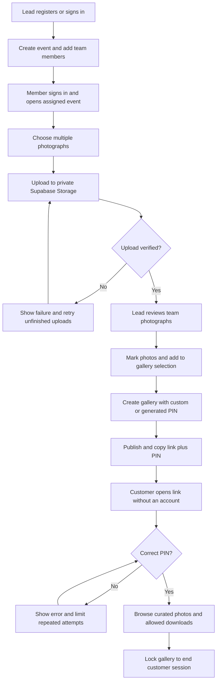
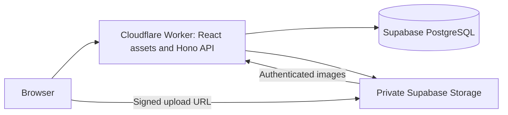
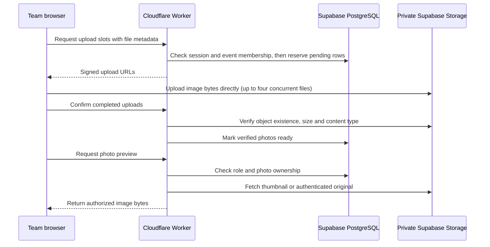
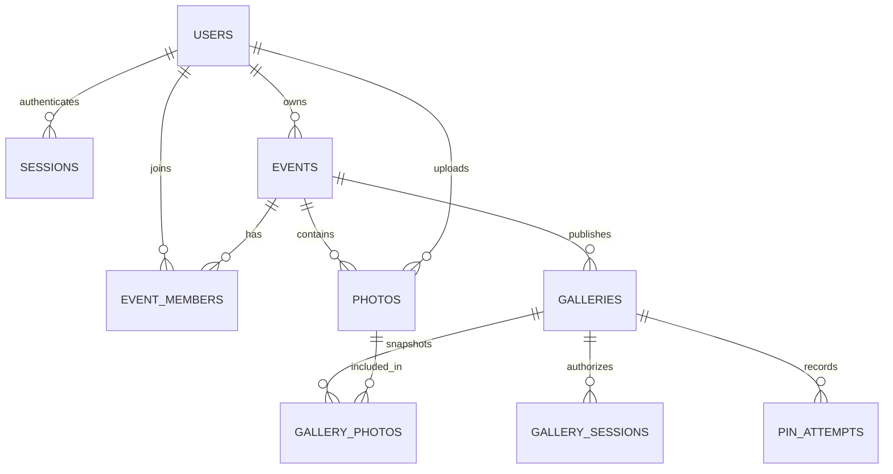
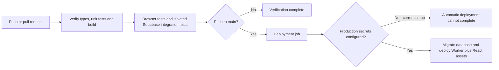

# Arc & Grain — Photo Sharing Platform

A photography team uploads images to an event, its lead selects a collection,
and a customer opens the published gallery with a link and a six-digit PIN.
Customers do not register or sign in to a team account.

## Submission links and demo access

| Deliverable | Link |
|---|---|
| Live application | [Open Arc & Grain](https://photos-api.shivanshugupta1109.workers.dev) |
| Public source code | [GitHub repository](https://github.com/shivanshu11092003/trizen) |
| Project documentation | [README on GitHub](https://github.com/shivanshu11092003/trizen/blob/main/README.md) |
| Customer demo | [Open the private gallery](https://photos-api.shivanshugupta1109.workers.dev/gallery/arjun-priya-2026-demo) |
| Requirement coverage | [Challenge checklist](docs/requirements.md) |

| Role | Email / account | Password / PIN | Start here |
|---|---|---|---|
| Admin / Lead | `admin@demo.trizen.dev` | Password: `TrizenDemo!2026` | [Team login](https://photos-api.shivanshugupta1109.workers.dev/login) |
| Team Member | `member1@demo.trizen.dev` | Password: `TrizenDemo!2026` | [Team login](https://photos-api.shivanshugupta1109.workers.dev/login) |
| Customer | No account required | Gallery PIN: `274913` | [Customer gallery](https://photos-api.shivanshugupta1109.workers.dev/gallery/arjun-priya-2026-demo) |

These are intentionally public demo credentials. Infrastructure credentials and
signing secrets are excluded from Git and supplied through the ignored root
`.env` and Cloudflare Worker secrets. GitHub deployment secrets have not been
configured; see [CI status](#github-actions-and-deployment-status).

For a quick review, open the customer gallery in a private browser window and
enter its PIN. Then sign in as the member to inspect uploads, and as the lead to
review selection, publishing and team management. Separate browser profiles keep
the two team sessions independent. Use a new event to try the full workflow.

The live lead/member/customer workflow has been verified, including real uploads,
an interrupted transfer and retry, publishing, PIN access, single/bulk deletion,
locking and unpublishing. Photo checkboxes start unchecked; marks are temporary
and are cleared on reload.

Submission deadline: **September 20, 2026, 11:59 PM IST**.

## Roles and workflow

1. Register a lead account, or sign in as the demo lead.
2. Create an event and use **Team → Add member**. For a new member, copy the
   one-time temporary password shown in the sign-in details dialog and give it to them.
3. The member signs in, opens an assigned event and uploads multiple photographs.
   Members can browse their own uploads. Only leads can select photos, manage
   team access, or publish galleries. These rules are enforced by the API as
   well as the interface.
4. The lead opens **Photographs**, marks photos, and adds them to the selection.
5. Under **Galleries → New gallery**, enter a title and a six-digit PIN, or leave
   the PIN blank to generate one. Publish immediately or save a draft.
6. Copy the link and PIN. Customers enter the PIN, browse the published photos,
   and optionally download them. **Lock gallery** ends their gallery session.

Unpublishing a gallery blocks both its photo list and image endpoints. Resetting
its PIN invalidates the old PIN and existing customer sessions. A published
snapshot remains unchanged when a lead changes the event's selection later. Deleting a
photo removes it from the event and every customer gallery, including downloads;
gallery counts and cover references update accordingly.

To delete one photo, open its preview and choose **Delete photograph**. For a
batch, mark the photographs (or use **Mark all loaded**) and choose **Delete marked**.
Both actions ask for confirmation. Batches contain up to 500 photos and either
succeed entirely or change nothing. Leads may delete any event photo; members
may delete only their own uploads within 15 minutes. Deletion uses the existing
soft-delete model: originals remain in private storage, and there is no restore
or permanent-purge action in the UI.

## Workflow diagrams



**Marks and gallery selection:** checking a circle marks a photo for the next
bulk action. **Add to selection** saves that choice for future galleries;
**Deselect** removes it. **Clear** only clears the temporary marks. The
**Selected** filter shows the saved selection. Existing published galleries keep
their snapshot when selection changes; explicit deletion removes a photo from
all galleries.

| Capability | Admin / Lead | Team Member | Customer |
|---|---|---|---|
| Team sign-in | Yes | Yes | No account needed |
| Create events | Registered workspace lead | No | No |
| Add/remove event members | Yes | No | No |
| Upload photographs | Yes | Assigned events | No |
| Browse team originals | All photos in their event | Own uploads only | No |
| Select photos and publish galleries | Yes | No | No |
| Delete photos | Any photo in their event | Own uploads within 15 minutes | No |
| View a published gallery | With its link and PIN | With its link and PIN | With its link and PIN |
| Download gallery photos | When enabled | When enabled | When enabled |

Roles apply per event. Knowing another event's ID does not grant access. Newly
registered leads can create events; a member invited as an event lead can manage
that event without automatically receiving workspace-wide creation rights.

## Technology choices

- **React 19, Vite, TypeScript:** route-split frontend with a responsive team
  workspace and a separate, lightweight customer gallery.
- **Hono on Cloudflare Workers:** validated API routes, cookie sessions, and
  static frontend hosting under one HTTPS origin. No separate Pages project
  or cross-origin authentication configuration is needed.
- **Supabase PostgreSQL and Drizzle:** relational event membership, photo
  metadata, gallery snapshots, sessions, and audit records. Transaction pooler
  connections disable prepared statements and are scoped to each Worker request.
- **Private Supabase Storage:** originals are uploaded using signed URLs.
  Image bytes are never stored in PostgreSQL. Thumbnails use transformations,
  falling back to an authenticated original if resizing is unavailable.
- **TanStack Query/Router/Virtual, Zustand, Ant Design:** data fetching, routing,
  virtualization, local UI preferences and team controls. Identity is not persisted
  in browser local storage.
- **Zod, OpenAPI, Hey API:** runtime input validation and generated frontend
  types/client. `docs/openapi.json` is generated from API routes.

## Architecture and database



`users` and `sessions` authenticate the team. `events` and `event_members` define
access and the lead/member role. `photos` stores IDs, event/uploader IDs, filename,
storage key, MIME type, byte size, dimensions, timestamps and curation state.
`galleries` stores publication state and a hashed PIN; `gallery_photos` stores
its ordered snapshot. `gallery_sessions`, `pin_attempts`, `rate_limits` and
`audit_log` support customer access and security.

The migration in `supabase/migrations` creates the tables, indexes, row-level
security, and private `photos-originals` bucket. There are no browser table
policies; application access goes through the API. Foreign keys and event-scoped
queries keep photos and galleries attached to their owning event. Gallery and
snapshot creation happens in one database transaction.

### Upload and access flow



Customer image requests use a gallery session created by PIN verification. The
Worker checks that the gallery is published and the photo belongs to its saved
snapshot before returning bytes. The browser never receives a service-role key.

### Database relationships



| Table group | Responsibility |
|---|---|
| `users`, `sessions` | Hashed passwords, server sessions and revocation |
| `events`, `event_members` | Event ownership, assigned users and per-event roles |
| `photos` | Metadata and storage keys; file bytes live in object storage |
| `galleries`, `gallery_photos` | PIN hash, publication state and ordered photo snapshot |
| `gallery_sessions`, `pin_attempts` | Customer access and incorrect-PIN tracking |
| `audit_log`, `rate_limits` | Recorded actions and request limits |

Photo IDs are ULIDs; timestamps use epoch milliseconds. Signed keyset cursors
support pagination without loading the entire collection. Event, uploader,
filename and selection indexes support the gallery filters. See the
[Drizzle schema](apps/api/src/db/schema.ts), [migration](supabase/migrations),
[OpenAPI specification](docs/openapi.json), and [architecture notes](docs/architecture.md).

### Repository map

```text
apps/web/             React frontend, team workspace and customer gallery
apps/api/             Hono Worker, authorization, routes, database and storage
packages/shared/      Validation schemas, errors, pagination and async helpers
packages/api-client/  Generated TypeScript client and query helpers
supabase/             Database migrations and local Supabase configuration
e2e/                  Browser checks and real Supabase workflow tests
docs/                 Architecture, requirements and generated API specification
```

## Local setup with hosted Supabase

Use Node **22.12+**, pnpm **11.3.0**, and a Supabase project. Docker is not needed
when using hosted Supabase.

```bash
pnpm install
cp .env.example .env
```

Fill the root `.env` with your own project values. The API's setup scripts read
that file and generate `apps/api/.dev.vars` for Wrangler. The root `.env` takes
precedence over an older `.dev.vars`; process environment variables take highest
precedence for CI.

```bash
pnpm --filter api db:migrate:remote
pnpm db:seed
pnpm dev
```

The migration command uses `DATABASE_URL` directly; there is no project reference
placeholder to substitute and no separate CLI linking step. Seeding creates the
demo users, event, 1,250 photo records, 600-photo gallery, and actual JPEG objects
based on the six checked-in sample images. To repair an older metadata-only seed:

```bash
pnpm --filter api db:seed:images
```

This repair preserves existing storage objects and targets only known demo rows.

Open http://localhost:5173. The API is at http://localhost:8787, with `/health`
for liveness and `/ready` for database plus storage readiness. Vite proxies `/api`
and `/img` to the Worker. API documentation is at http://localhost:8787/docs.

For an entirely local Supabase stack, install Docker, leave the hosted `.env`
out of this checkout, then run:

```bash
pnpm supabase:start
pnpm env:local
pnpm db:seed
pnpm dev
```

`pnpm db:migrate` resets the **local** database and deletes its existing data.
Use `db:migrate:remote` to apply pending migrations to the configured hosted DB.

## Environment variables

| Variable | Value / purpose |
|---|---|
| `DATABASE_URL` | Supabase PostgreSQL transaction pooler URI, port 6543; URL-encode special characters in the password |
| `SUPABASE_URL` | Your Supabase project URL |
| `SUPABASE_SERVICE_ROLE_KEY` | Server-only service-role JWT or supported secret API key |
| `SUPABASE_STORAGE_BUCKET` | `photos-originals`; a bucket name, not an S3 endpoint URL |
| `CURSOR_SECRET` | Random secret for signing pagination cursors |
| `IP_HASH_PEPPER` | Random secret for hashing IP addresses |
| `PIN_PEPPER` | Server secret used to HMAC passwords and PINs before salted PBKDF2 hashing |
| `PUBLIC_ORIGIN` | `http://localhost:5173` locally; production defaults to the incoming Worker origin |
| `DOCS_ENABLED` | `true` locally; production Worker configuration sets `false` |

Generate each secret independently with `openssl rand -base64 32`. Do not put
backend secrets in `VITE_*` variables or frontend code. Keep `PIN_PEPPER` stable
for the lifetime of existing password and PIN hashes; replacing it requires
resetting those credentials. Local environment generation preserves existing secrets.

## Deployment: frontend and API on one Cloudflare Worker

The production configuration in `apps/api/wrangler.toml` includes the built React
assets, SPA routing and API routes. First connect Cloudflare:

```bash
pnpm --filter api exec wrangler login
pnpm deploy
```

`pnpm deploy` builds the frontend and API, applies pending database migrations,
loads backend secrets into the production Worker, then deploys both the frontend
and API. Supabase remains the database and storage service. Save Wrangler's
public `https://photos-api.<account-subdomain>.workers.dev` URL in the submission
links above and verify its `/ready` endpoint. Customers use this origin plus their
gallery path. Demo access is available if the configured database was seeded.

## GitHub Actions and deployment status

The repository is public. **CI verification and cloud deployment are separate
jobs.** In [run 34757855267](https://github.com/shivanshu11092003/trizen/actions/runs/34757855267),
the `verify` job passed its type checks, unit tests, build, generated-contract
checks, browser tests and integration tests against an isolated local Supabase
instance. The `deploy` job failed at the migration/deployment step.

GitHub production deployment secrets have not been configured. The live
application was deployed manually with Wrangler using credentials stored outside
Git. Missing deployment credentials prevent automated deployment; repository
visibility does not prevent CI verification. Public repositories can use
[GitHub Actions secrets](https://docs.github.com/en/actions/how-tos/write-workflows/choose-what-workflows-do/use-secrets)
without committing credentials to source code.



To enable automated deployment, configure the GitHub **production** environment
under repository **Settings → Environments → production → Environment secrets**:

| Secret | Purpose |
|---|---|
| `CLOUDFLARE_API_TOKEN` | Authorize Worker deployments |
| `CLOUDFLARE_ACCOUNT_ID` | Select the Cloudflare account |
| `DATABASE_URL` | Apply migrations and connect the Worker to PostgreSQL |
| `SUPABASE_URL` | Identify the Supabase project |
| `SUPABASE_SERVICE_ROLE_KEY` | Access private storage from the server |
| `SUPABASE_STORAGE_BUCKET` | Select the private image bucket |
| `CURSOR_SECRET` | Sign pagination cursors |
| `PIN_PEPPER` | Protect password and PIN hashes |
| `IP_HASH_PEPPER` | Hash IP addresses in server records |

Use the same existing application secrets when deploying against the existing
database, especially `PIN_PEPPER`. The workflow reads secrets from the GitHub
secret store; no `.env` file or production credential should be committed.
The [workflow file](.github/workflows/ci.yml) defines the exact steps.

## Security and failure handling

- HMAC-SHA256 with a server pepper, followed by salted PBKDF2-SHA256 at 100,000
  iterations (the production Worker limit), protects password/PIN hashes.
  Opaque, revocable session tokens are stored as hashes. HTTPS team cookies
  are HttpOnly and Secure.
- Event membership and role checks on every protected API operation. Members'
  photo lists and image access are restricted to their own event uploads.
- CSRF origin and double-submit token checks for authenticated mutations.
- Signed, private uploads with MIME type, file-size and batch validation.
  Confirmation verifies stored object size/type before making a photo ready.
- Four concurrent browser uploads; successful files remain ready if another
  fails, and unfinished uploads can be retried without reuploading completed ones.
- PIN attempt limits; customer image and list endpoints require a valid gallery
  session and a currently published, unexpired gallery.
- Unknown and inaccessible events are hidden with 404 responses. Invalid input
  uses a consistent 422 error envelope with field details and a request ID.
- Missing storage objects show a clear unavailable-image state.

## Tests and verification

```bash
pnpm typecheck
pnpm test
pnpm test:e2e
pnpm test:integration
pnpm test:e2e:live
pnpm build
pnpm gen:api
```

Verification performed for the current functionality:

| Check | Result |
|---|---|
| Unit tests | 31 passed |
| API integration | 93 HTTP checks plus workflow assertions passed |
| Desktop/mobile browser cases | 26 cases passed across the completed runs |
| Real Supabase browser workflow | Passed locally and on the deployed Worker |
| Default photo-checkbox behavior | Verified unchecked initial state, manual marking, Clear and reload |
| Type checks and production build | Passed |

Unit tests cover security primitives, pagination, concurrency, and storage error
handling. Browser tests cover login gating, member controls, required PIN entry,
locking, missing images, and responsive layouts using deterministic API fixtures.

`test:integration` starts an isolated local Worker on port 8799 and uses the
Supabase project configured in the environment. It creates unique test users and
events, uploads actual images, verifies the entire lead/member/customer workflow,
and cleans up its own records and objects. With `pnpm dev` running,
`pnpm test:e2e:live` also exercises registration, event creation, member invitation,
real multi-file uploads, an interrupted transfer and retry, selection, custom-PIN
publishing, customer browsing, single/bulk deletion, locking and unpublishing through the browser.
To run that browser workflow against the deployed application:

```bash
LIVE_APP_URL=https://photos-api.shivanshugupta1109.workers.dev pnpm test:e2e:live
```

The API integration test checks authentication, CSRF,
cross-event access, member publishing/edit/delete restrictions, failed-upload
confirmation, selection snapshots, custom PINs, incorrect PINs, unpublished
photos, downloads, PIN rotation, membership revocation, and logout.

## Known limitations

- Demo image fixtures repeat six sample photographs; they are not 1,250 distinct
  full-resolution wedding originals.
- New-member delivery uses a one-time temporary password shown to the lead.
  Automated invitation email and password-recovery flows are not implemented.
- Transformation fallback downloads the original and uses more bandwidth.
- ZIP downloads stream without a known Content-Length; very large galleries can
  take a long time. Download disabling controls the provided download actions,
  but cannot prevent someone from saving an image already displayed to them.
- The workflow is tested functionally; large-scale load testing remains future work.
