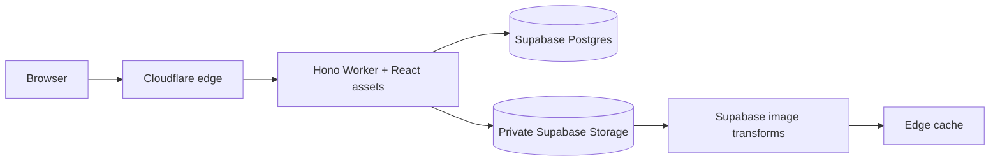
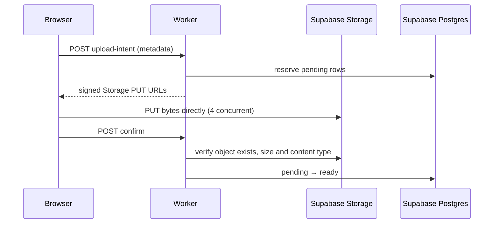
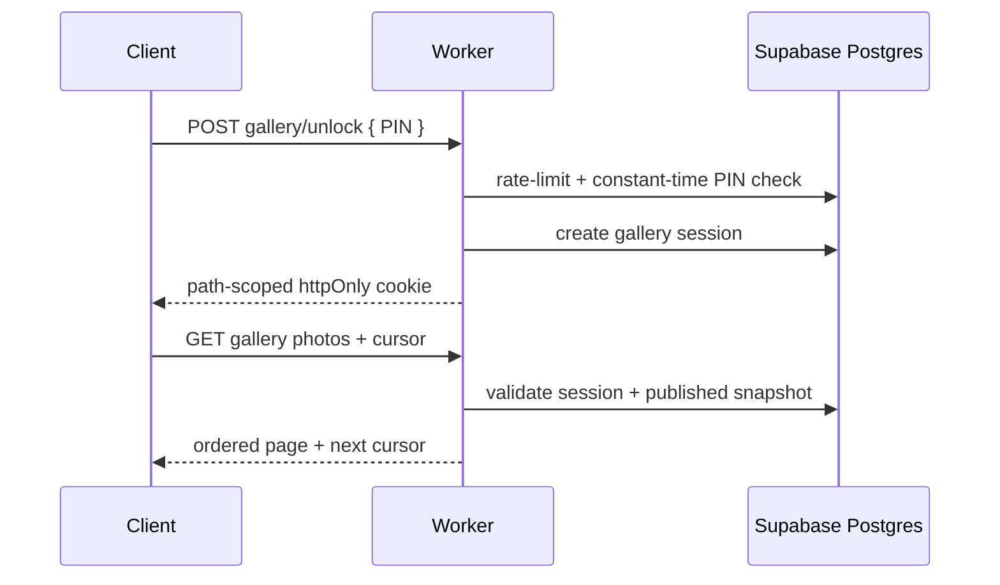

# Architecture notes

The app is deployed on one origin. A Cloudflare Worker serves the React static assets
and owns `/api/*` and `/img/*`; API documentation is disabled in production. Keeping those paths on
one hostname is a security decision: the team session can stay in an httpOnly,
`SameSite=Strict`, `__Host-` cookie and no CORS policy exists to misconfigure.

## Pagination invariant

Every cursor is `base64url(JSON).base64url(HMAC-SHA-256)`. The signed JSON holds
only a version, key tuple, direction, and sort fingerprint. The event/member
predicate is owned by the handler and can never be widened by cursor input.
Forward queries fetch `limit + 1`; previous-page queries invert comparison and
ordering, then reverse the result before returning it.
